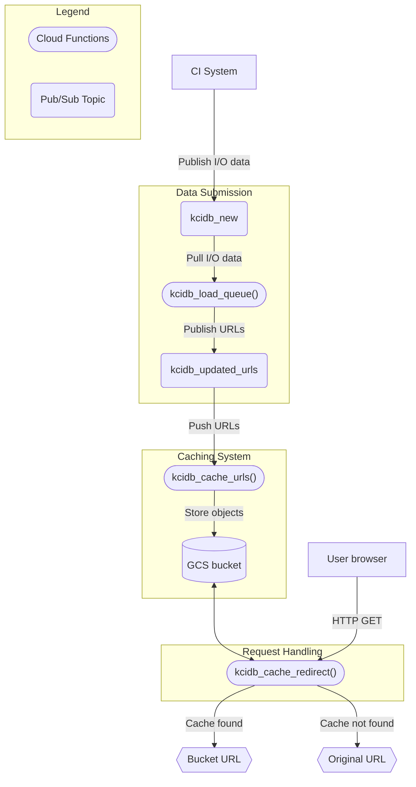

Architecture
-----

Kcidb infrastructure is mostly based on Google Cloud services at the moment:

    === Hosts ===  ======================= Google Cloud Project ========================

    ~ Webserver ~                                                    ~~~~ BigQuery ~~~~~
    kcidb-grafana <-------------------------------------------------  .. kcidb_XX ..
                                                                     :   checkouts  :
    ~~ Client ~~~                                                    :   builds     :
    kcidb-query <--------------------------------------------------- :   tests      :
                                                                      ''''''''''''''
                    ~~ Pub/Sub ~~       ~~~~ Cloud Functions ~~~~            ^
                    kcidb_trigger ----------.                                |
                                            v                                |
    kcidb-submit -> kcidb_new --------> kcidb_load_queue --------------------'
                                            |
                          .-----------------'
                          v                                          ~~~~ Firestore ~~~~
                    kcidb_updated ----> kcidb_spool_notifications -> notifications
                                                                           |
                                                   .-----------------------'
                                                   |
                                                   v                 ~ Secret Manager ~~
                                        kcidb_send_notification <--- kcidb_smtp_password
                                                   |
                                                   |                 ~~~~~~ GMail ~~~~~~
                                                   `---------------> bot@kernelci.org

BigQuery stores the report dataset and serves it to Grafana dashboards hosted
on kcidb.kernelci.org, as well as to any clients invoking `kcidb-query` or
using the kcidb library to query the database.

Whenever a client submits reports, either via `kcidb-submit` or the kcidb
library, they go to a Pub/Sub message queue topic named `kcidb_new`, then to
the `kcidb_load_queue` "Cloud Function", which loads the data to the BigQuery
dataset, and then pushes the list of updated objects to `kcidb_updated` topic.
The `kcidb_load_queue` function is triggered periodically via messages to
`kcidb_trigger` topic, pushed there by the Cloud Scheduler service.

That topic is watched by `kcidb_spool_notifications` function, which picks up
the data, generates report notifications, and stores them in a Firestore
collection named `notifications`.

The last "Cloud Function", `kcidb_send_notification`, picks up the created
notifications from the Firestore collection, and sends them out through GMail,
using the `bot@kernelci.org` account, authenticating with the password stored
in `kcidb_smtp_password` secret, within Secret Manager.

### Caching System

1. **Publishing Initial Data**: The CI System initiates the process by publishing I/O data to the `kcidb_new` topic. This topic acts as a holding area for the data.

2. **URLs Extraction**:
The `kcidb_load_queue()` function pulls the I/O data from the `kcidb_new` topic, store it in the database and also extracts URLs from it. This extracted URL data is then published to the `kcidb_updated_urls` topic.

3. **URL Processing and Cache Logic**: The `kcidb_cache_urls()` function receives the URLs from the `kcidb_updated_urls` topic and fetch the file from that location and store them in the Google Cloud Storage Bucket.

### Cache Request Handling

1. **User File Request**: When a user requests a file then that request is directed to the `kcidb_cache_redirect()` cloud function. This function serves as the entry point for processing user requests and initiating the cache lookup process.

2. **Cache Lookup**: The `kcidb_cache_redirect()` function interacts with the Google Cloud Storage Bucket to find and serve the file from there, if its available.

3. **File Availability Check**: If the requested file is found within the cache storage, the `kcidb_cache_redirect()` function performs a redirection to the location of the file within the Google Cloud Storage Bucket and serve it to the user.

4. **Fallback Mechanism**: In cases where the requested file is not present within the ccache storage, then `kcidb_cache_redirect()` function redirect the user to the original URL from which the file was initially requested.

Setup
-----

To setup and manage most of Google Cloud services you will need the `gcloud`
tool, which is a part of Google Cloud SDK. You can install it and create a
Google Cloud Project by following one of the [official quickstart
guides](https://cloud.google.com/sdk/docs/quickstarts). The instructions below
assume the created project ID is `kernelci-production` (yours likely won't be).

Authenticate the gcloud tool with your Google account:

    gcloud auth login

Select the project you just created:

    gcloud config set project kernelci-production

Create an administrative service account (`kernelci-production-admin` from here on):

    gcloud iam service-accounts create kernelci-production-admin

Grant the administrative service account the project owner permissions:

    gcloud projects add-iam-policy-binding kernelci-production \
           --member "serviceAccount:kernelci-production-admin@kernelci-production.iam.gserviceaccount.com" \
           --role "roles/owner"

Generate the account key file (`kernelci-production-admin.json` here):

    gcloud iam service-accounts keys create kernelci-production-admin.json \
           --iam-account kernelci-production-admin@kernelci-production.iam.gserviceaccount.com

NOTE: This key allows anyone to do **anything** with the specified
      Google Cloud project, so keep it safe.

Select the account key for use with Google Cloud API (which kcidb uses):

    export GOOGLE_APPLICATION_CREDENTIALS=`pwd`/kernelci-production-admin.json

Clone kcidb repository, checkout the revision you want to deploy, and install
kcidb as described in [README.md](README.md).

### Additional Dependencies

While deploying you may also need to install `psql`. It is a command-line
tool for interacting with the PostgreSQL database. It is used to manage
and manipulate data stored in a PostgreSQL database, as well as to
administer and configure the database itself.

For Debian-based distros like Ubuntu:
   
    apt-get install postgresql-client

For Fedora-based distros like CentOS and RHEL:

    sudo dnf install postgresql

Verify the psql installation: 
   
    psql --version

Once the installation is complete, you can use `psql` for the
deployment of the project.

### Deploying

Use the `cloud` tool located in the root of kcidb repository to deploy the base
setup. Assuming your current directory is the repository root, this command:

    ./cloud deploy PROJECT NAMESPACE VERSION

will create an installation in Google Cloud project `PROJECT`, all object
names prefixed with `NAMESPACE_`, and BigQuery dataset with name ending with
the `VERSION` number.

You can rerun the command any number of times to have the installation
updated.

You will be asked to enter the SMTP user password if the corresponding secret
is not found. You can use the `--smtp-password-file` option to supply it
explicitly when creating the secret, or to update the secret on successive
runs.

Use the `--smtp-to-addrs` to specify comma-separated email addresses to send
reports to, instead of sending them to their intended recipients. The
recipients are overridden to `kernelci-results-staging@groups.io` by default.
Specify an empty string to configure sending to actual recipients.

Use the `--log-level` option to specify the (Python-style) logging level of
Cloud Functions.

Use the `--submitter` option to specify the name of a service account which
should be permitted to submit data to KCIDB. Repeat to add more accounts.

Use the `-v/--verbose` option to make the tool report the progress of the
installation.

Finally, you can use the `-s/--sections` option to specify and extended shell
glob matching the "sections" of the installation to restrict the deployment
to. See the output of `cloud list-sections` for a list of available sections.

### Withdrawing

Use the `cloud` tool located in the root of kcidb repository to "withdraw"
(remove) the base setup. Assuming your current directory is the repository
root, this command:

    ./cloud withdraw PROJECT NAMESPACE VERSION

Will remove the installed objects with names prefixed with `NAMESPACE_`, and
the BigQuery dataset with name ending with the `VERSION` number from Google
Cloud project `PROJECT`.

You can use the `-v/--verbose` and `-s/--sections` similarly to `cloud deploy`
command, adding `--submitter` options will remove permissions to submit for
the specified service accounts.

### Grafana

See
[kcidb-grafana README.md](https://github.com/kernelci/kcidb-grafana/#setup)
for setup instructions.

### CI System Accounts

Each submitting/querying CI system needs to have a service account created,
permissions assigned, and the account key generated. Below is an example for
a CI system called "CKI" having account named "kernelci-production-ci-cki" created.

Create the service account:

    gcloud iam service-accounts create kernelci-production-ci-cki

Generate the account key file (`kernelci-production-ci-cki.json` here) for use by
the CI system:

    gcloud iam service-accounts keys create kernelci-production-ci-cki.json \
           --iam-account kernelci-production-ci-cki@kernelci-production.iam.gserviceaccount.com

Grant the account permissions for the BigQuery dataset and the submission
queue using the "cloud" tool located in the root of the kcidb repository:

    ./cloud deploy kernelci-production "" 0 --section submitters \
                 --submitter kernelci-production-ci-cki

Upgrading
---------

### BigQuery

To upgrade the dataset schema, do the following.

1. Authenticate to Google Cloud with the key file (`~/.kernelci-bq.json`
   here):

        gcloud auth activate-service-account --key-file ~/.kernelci-bq.json

   or login with your credentials (entered via a browser window):

        gcloud auth login

2. Create a new dataset (`kernelci02` in project `kernelci` here) with the new
   schema:

        bq mk --project_id=kernelci kernelci02
        # Using new-schema kcidb
        kcidb-db-init -d bigquery:kernelci02

3. Switch all data submitters to using new-schema kcidb and the newly-created
   dataset.

4. Create a new dataset with the name of the old one (`kernelci01` here), but
   with `_archive` suffix, using the old-schema kcidb:

        # Using old-schema kcidb
        kcidb-db-init -d bigquery:kernelci01_archive

5. Using BigQuery management console, shedule copying the old dataset to the
   created dataset. When that is done, remove the old dataset.

6. Transfer data from the copy of the old dataset (named `kernelci01_archive`
   here) to the new dataset (named `kernelci02` here) using old-schema
   `kcidb-db-dump` and new-schema `kcidb-db-load`.

        # Using old-schema kcidb
        kcidb-db-dump -d bigquery:kernelci01_archive > kernelci01_archive.json
        # Using new-schema kcidb
        kcidb-db-load -d bigquery:kernelci02 < kernelci01_archive.json

